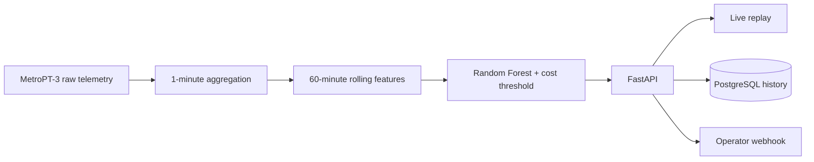

# MetroPT-3 — Industrial Condition Monitoring

[](https://www.python.org/)
[](https://fastapi.tiangolo.com/)
[](https://www.docker.com/)
[](https://el6-electrode-ml.onrender.com/)

Портфолио-проект Data Scientist / ML Engineer: мониторинг состояния воздушного
компрессора вспомогательной пневмосистемы поезда. Модель оценивает, похожа ли
текущая телеметрия на состояние во время документированной утечки воздуха.

**[Live Monitoring](https://el6-electrode-ml.onrender.com/)** ·
**[API](https://el6-electrode-ml.onrender.com/docs)**

## Что сделано

- Реальная обезличенная промышленная телеметрия **MetroPT-3**, 1 516 948
  исходных строк и 15 сигналов.
- Честное временное разделение: первые события для обучения, третье для выбора
  порога, последнее для финального теста.
- Воспроизведение нормального участка и документированного отказа в интерфейсе.
- FastAPI, Docker, MLflow, PostgreSQL-история прогнозов и тревог.
- Уведомление во внешний webhook с 15-минутной защитой от повторов.
- Регламент реакции оператора и форма согласования цены ошибок с экспертом.

## Данные и постановка задачи

Источник: [UCI MetroPT-3](https://archive.ics.uci.edu/dataset/791/metropt%203%20dataset),
DOI `10.24432/C5VW3R`, лицензия CC BY 4.0. Данные собраны на действующем
компрессоре метро с февраля по август 2020 года и не содержат персональных
данных. В репозитории хранится производная минутная выборка; авторство и
лицензия исходного набора сохраняются.

Исходные измерения агрегированы средним по одной минуте. К каждому из 15
сигналов добавлены среднее и стандартное отклонение за предыдущие 60 минут.
Цель `air_leak_condition` равна 1 внутри четырёх интервалов утечки, приведённых
авторами набора. Это **детектор текущего состояния**, а не прогноз точного
момента будущей поломки и не система безопасности.



## Проверенный baseline

Рабочая гипотеза цены ошибок: пропуск отказа в 25 раз дороже ложной тревоги.
Она ещё не утверждена производственным экспертом. Порог выбран только на
валидационном периоде, тестовый период содержит отдельное июльское событие.

| Метрика на тесте | Значение |
| --- | ---: |
| Порог | 0.001 |
| Recall отказа | 0.952 |
| Precision отказа | 0.048 |
| F1 отказа | 0.091 |
| ROC-AUC | 0.945 |
| PR-AUC | 0.099 |
| Базовая доля отказа | 0.003 |

Матрица ошибок: TN 81 288, FP 5 101, FN 13, TP 257. Модель находит 95.2%
минут отказа, но редкий класс и перенос между разными событиями дают много
ложных тревог. PR-AUC примерно в 32 раза выше случайного baseline, однако
precision 4.8% недостаточен для автономного производственного решения.
Практическая следующая итерация — группировать соседние минуты в один инцидент
и согласовать допустимое число инцидентов за смену.

[Политика порога](reports/decision_policy.md) ·
[Регламент оператора](reports/operator_response_playbook.md) ·
[Форма встречи с экспертом](reports/expert_review_form.md)

## Локальный запуск

```bash
python3.12 -m venv .venv
source .venv/bin/activate
python -m pip install -r requirements.txt
python src/train.py
python -m uvicorn app.main:app --reload
```

Откройте http://127.0.0.1:8000/ или http://127.0.0.1:8000/docs.

Чтобы заново получить производную выборку, скачайте официальный CSV и выполните:

```bash
python src/prepare_metropt3.py "/path/to/MetroPT3(AirCompressor).csv"
```

## Docker

```bash
docker build -t el6-electrode-ml .
docker run --rm -p 127.0.0.1:8000:8000 el6-electrode-ml
```

Для сохранения локальной истории между контейнерами:

```bash
docker run --rm -p 127.0.0.1:8000:8000 \
  -e STATE_DB_PATH=/app/storage/monitoring.db \
  -v el6-monitoring:/app/storage el6-electrode-ml
```

## Уведомления оператору

Приложение всегда показывает тревоги в интерфейсе и истории. Для отправки во
внешнюю систему задайте адрес корпоративного webhook:

```bash
export ALERT_WEBHOOK_URL="https://example.internal/condition-alerts"
export ALERT_WEBHOOK_TOKEN="optional-secret"
```

На новую тревогу отправляется JSON с машиной, риском, порогом, ID прогноза и
рекомендуемым действием. Конкретный Slack/Teams/SCADA адрес должен предоставить
владелец системы; проект не содержит выдуманных получателей.

## MLflow и мониторинг

`python src/train.py` записывает параметры, модель, тестовые метрики и анализ
порога в `mlflow.db`. Интерфейс MLflow:

```bash
mlflow ui --backend-store-uri sqlite:///mlflow.db --port 5000
```

Вкладка «Мониторинг модели» показывает поток запросов, тревоги, сдвиг признаков
и метрики по подтверждённым оператором исходам. На Render история хранится в
PostgreSQL. Бесплатная база Render истекает через 30 дней.

## Ограничения

- MetroPT-3 относится к железнодорожному компрессору, а не к электродному
  производству; перенос на другой агрегат потребует его собственных данных.
- Метки заданы интервалами отказов, поэтому соседние строки одного события не
  являются независимыми поломками.
- Порог и цена ошибок — проверяемая рабочая гипотеза до письменного решения
  производственного эксперта.
- Модель не заменяет ПЛК, штатные защиты, инструкции и решение оператора.
