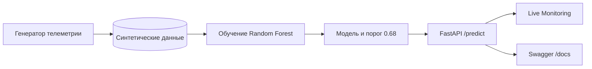
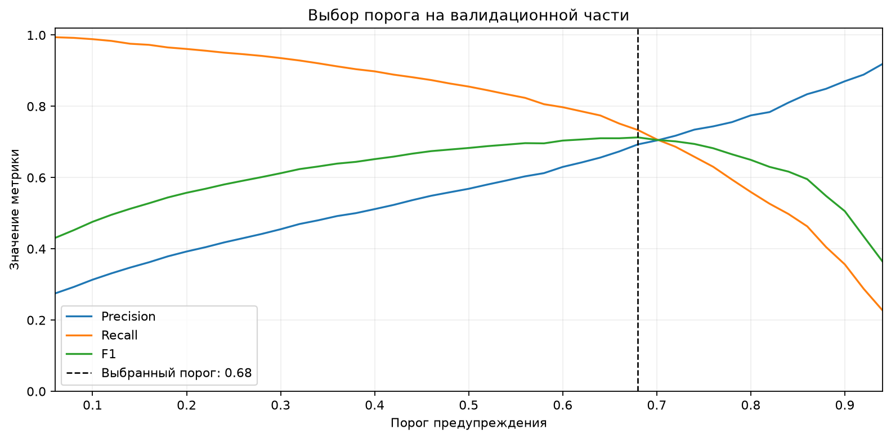

# EL6 / Electrode Factory — ML Predictive Maintenance

[](https://www.python.org/)
[](https://fastapi.tiangolo.com/)
[](https://www.docker.com/)

Учебный проект для портфолио Data Scientist / ML Engineer. Модель оценивает
риск перегрева оборудования в следующие 10 минут по текущей телеметрии.

## Что можно посмотреть

- Live Monitoring трёх виртуальных станков с обновляемой телеметрией.
- Сценарий перегрева: риск растёт, пересекает порог и вызывает тревогу.
- Ручной прогноз через веб-интерфейс или `POST /predict`.
- Временное разделение данных, отдельная валидация порога и финальный тест.
- Воспроизводимая сборка: Docker сам создаёт данные и обучает модель.

[](https://render.com/deploy?repo=https://github.com/Nikitaaa2619/el6_electrode_ml_project)

## Важное ограничение

Все данные в проекте **синтетические**. Это не телеметрия ЭЛ6/НОВЭЗ, не
реальные производственные уставки и не подтверждённая модель оборудования.
ML-модель не управляет станком и не заменяет штатную защиту или ПЛК.

Целевая колонка `overheat_next_10min` — искусственная метка риска, рассчитанная
генератором из будущей температуры и дополнительных сигналов.

## Как устроен проект



CSV и обученная модель не хранятся в Git. Их можно создать локально, а при
сборке Docker-образа они создаются автоматически с фиксированным `random_state`.

## Локальный запуск

Рекомендуемая версия — Python 3.12.

```bash
python3.12 -m venv .venv
source .venv/bin/activate
python -m pip install -r requirements.txt
python -m pip check
python src/generate_data.py
python src/train.py
python -m uvicorn app.main:app --reload
```

После запуска доступны:

- Live Monitoring трёх станков и ручной прогноз: http://127.0.0.1:8000/
- интерактивная документация: http://127.0.0.1:8000/docs
- проверка состояния API: http://127.0.0.1:8000/health

В режиме Live Monitoring браузер создаёт учебный поток телеметрии и отправляет
его в настоящее API модели. Кнопка «Симулировать перегрев» постепенно ухудшает
показатели выбранного станка, чтобы показать рост риска и срабатывание порога.
Это демонстрация на синтетических данных, а не цифровой двойник реального цеха.

## Исследовательский анализ данных

После генерации CSV запустите:

```bash
python notebooks/01_eda.py
```

Сценарий проверяет качество данных, сравнивает классы и станки, строит графики
температур, износа, корреляций и временной динамики. Готовый отчёт находится в
[`reports/eda_summary.md`](reports/eda_summary.md).

## Проверенный baseline

Результаты получены 29 сентября 2026 года на временном разделении 60/20/20:
обучение, выбор порога и финальный тест. Между частями оставлен 10-минутный
зазор. На валидации выбран порог 0.68 с максимальным F1. Кандидаты проверяются
с шагом 0.02, чтобы не подгонять решение под незначительные различия вычислений.

| Метрика | Значение |
| --- | ---: |
| Accuracy | 0.925 |
| Precision, класс риска | 0.576 |
| Recall, класс риска | 0.734 |
| F1, класс риска | 0.645 |
| ROC-AUC | 0.953 |
| Average precision (PR-AUC в выводе) | 0.691 |

Матрица ошибок: 10241 верное нормальное состояние, 605 ложных тревог,
297 пропущенных случаев риска и 821 верно найденный случай риска. Accuracy
простой стратегии «всегда нет риска» равна 0.907, поэтому для этой задачи всё
равно нужно рассматривать recall, precision и PR-AUC вместе.



Полная таблица порогов и ошибок сохранена в
[`reports/threshold_analysis.csv`](reports/threshold_analysis.csv).

Эти результаты описывают только искусственные данные текущего генератора и не
доказывают качество модели на реальном производстве.

## Запуск в Docker

Docker самостоятельно генерирует учебные данные и обучает модель:

```bash
docker build -t el6-electrode-ml .
docker run --rm -p 127.0.0.1:8000:8000 el6-electrode-ml
```

После запуска интерфейс доступен по адресу http://127.0.0.1:8000/, а
документация — по адресу http://127.0.0.1:8000/docs. `Control+C` останавливает контейнер, а `--rm`
удаляет его остановленный экземпляр; Docker-образ остаётся.

## Публичный запуск на Render

В корне репозитория находится `render.yaml`: он описывает Docker-сервис,
бесплатный план и проверку `/health`. После отправки файлов в GitHub нажмите
кнопку **Deploy to Render** в начале README, войдите в Render и примените
Blueprint. Сервис получит публичный адрес вида `https://...onrender.com`.

Бесплатный сервис засыпает после периода без запросов, поэтому первое открытие
после паузы может занять больше времени.

## Ограничения текущей версии

- Даже улучшенный генератор остаётся упрощённой учебной симуляцией и не
  воспроизводит физику реального производственного оборудования.

## Дальнейшее развитие

1. Согласовать целевую цену пропущенного риска и ложной тревоги с экспертом.
2. Добавить MLflow и мониторинг качества модели.
3. Добавить хранение истории тревог между перезапусками сервиса.
