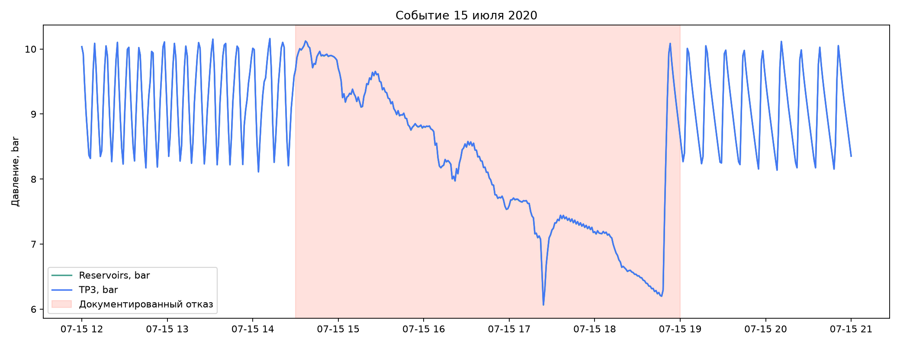

# Исследовательский анализ MetroPT-3

## Качество данных

- Минутных строк: 252,720
- Период: 2020-02-01 00:00:00 — 2020-09-01 03:59:00
- Пропущенных значений: 0
- Повторяющихся timestamp: 0
- Доля минут внутри отказов: 1.963%

| Часть | Строк | Доля отказа |
| --- | ---: | ---: |
| test | 86,659 | 0.312% |
| train | 142,557 | 1.282% |
| validation | 23,504 | 12.181% |

## Сигналы

На графиках сравниваются минутные наблюдения внутри и вне интервалов утечки.
Это описательный анализ: различия не доказывают причинность.

## Временное событие

Последнее документированное событие 15 июля полностью оставлено для теста.
Цветная область показывает его интервал.

## Вывод

Класс редкий и события различаются между собой. Поэтому случайное перемешивание
строк завысило бы качество: соседние минуты почти одинаковы. В проекте
использовано хронологическое разделение по отдельным событиям, а итог нужно
оценивать также по числу тревожных инцидентов, а не только минут.
