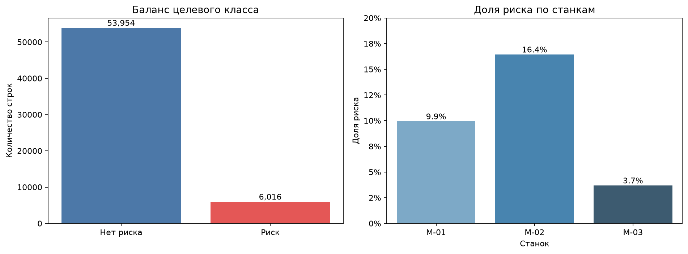
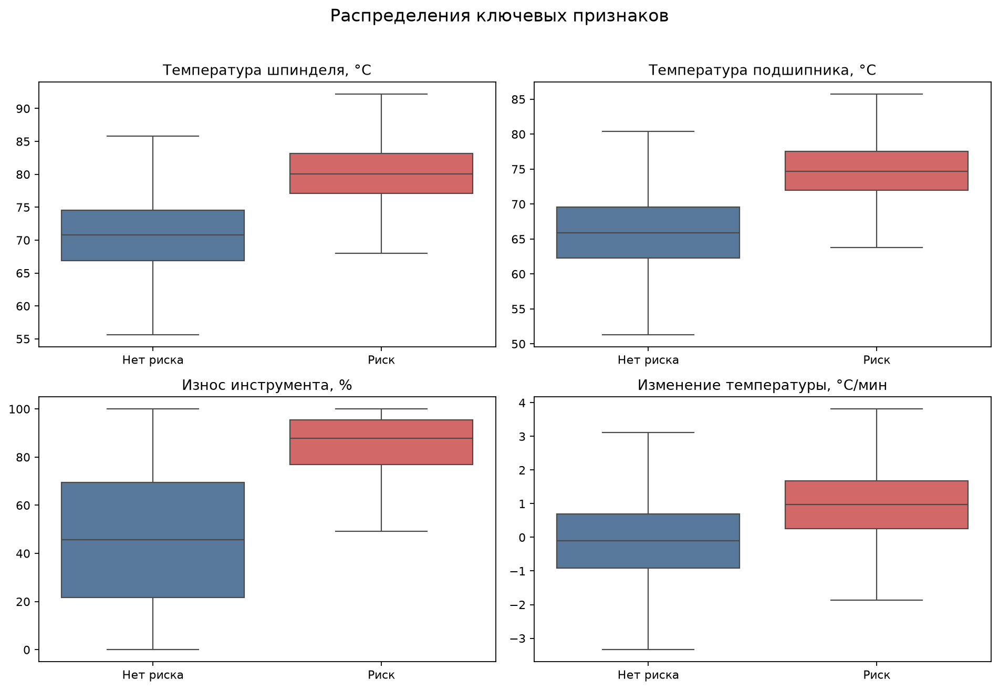
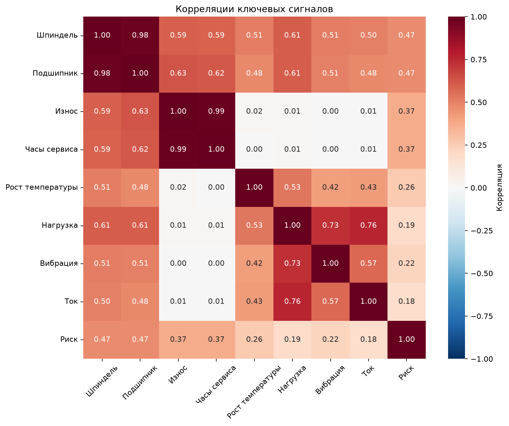
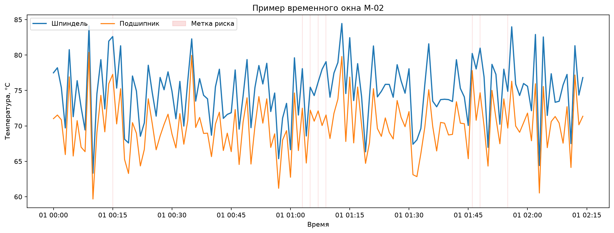
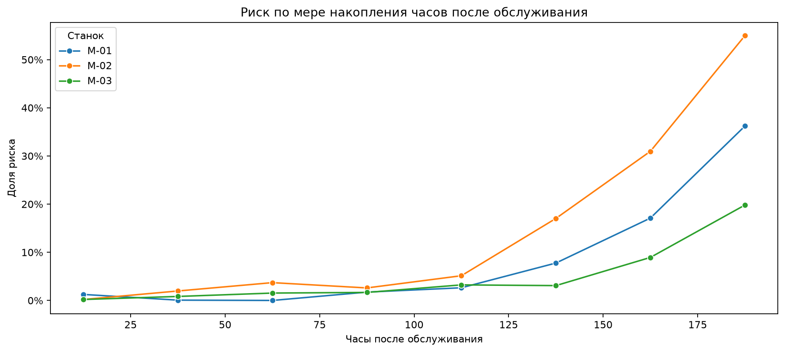

# Исследовательский анализ синтетической телеметрии

## Качество и состав данных

- Строк: 59,970
- Колонок: 16
- Период: 2026-01-01 00:00:00 — 2026-01-14 21:09:00
- Пропущенных значений: 0
- Полных дубликатов: 0
- Общая доля риска: 10.03%

- `M-01`: 9.94% риска (19,990 строк)
- `M-02`: 16.45% риска (19,990 строк)
- `M-03`: 3.70% риска (19,990 строк)

## Различия между классами

| Признак | Нет риска | Риск | Разница |
| --- | ---: | ---: | ---: |
| Температура шпинделя, °C | 70.69 | 80.37 | +9.68 |
| Температура подшипника, °C | 65.85 | 74.88 | +9.04 |
| Изменение температуры, °C/мин | -0.11 | 0.98 | +1.09 |
| Износ инструмента, % | 46.06 | 82.88 | +36.82 |
| Нагрузка, % | 57.60 | 67.34 | +9.74 |
| Вибрация RMS | 2.24 | 2.52 | +0.29 |
| Ток двигателя, A | 18.34 | 19.65 | +1.31 |
| Часы после обслуживания | 92.25 | 164.78 | +72.53 |

Риск связан прежде всего с температурой шпинделя и подшипника, износом,
часами после обслуживания и положительной скоростью изменения температуры.
Это ожидаемо: генератор использует эти сигналы при создании искусственной
метки. Корреляция показывает совместное изменение, а не причинность.

## Временная динамика и обслуживание

Красная область на временном графике показывает минуты, для которых генератор
поставил метку риска в следующие 10 минут.

Риск растёт ближе к концу искусственного 200-часового интервала обслуживания.
Различия между станками заданы профилями генератора: у `M-02` выше базовая
нагрузка и температура, у `M-03` — ниже.

## Выводы для модели

1. Accuracy нельзя оценивать отдельно: около 90% строк относятся к классу без
   риска, поэтому простая стратегия «всегда нет риска» уже получает высокую
   accuracy и при этом пропускает все предупреждения.
2. Температуры, износ и часы после обслуживания сильно связаны друг с другом.
   Важность признаков Random Forest не следует трактовать как причинность.
3. Порог предупреждения нужно выбирать на отдельной валидационной части,
   сравнивая пропущенные риски с количеством ложных тревог.
4. Все закономерности созданы формулами генератора. Для реального применения
   потребуются реальные данные, проверка разметки и анализ с инженерами.
